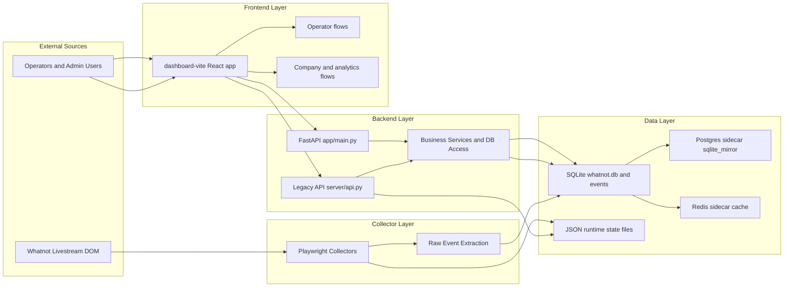
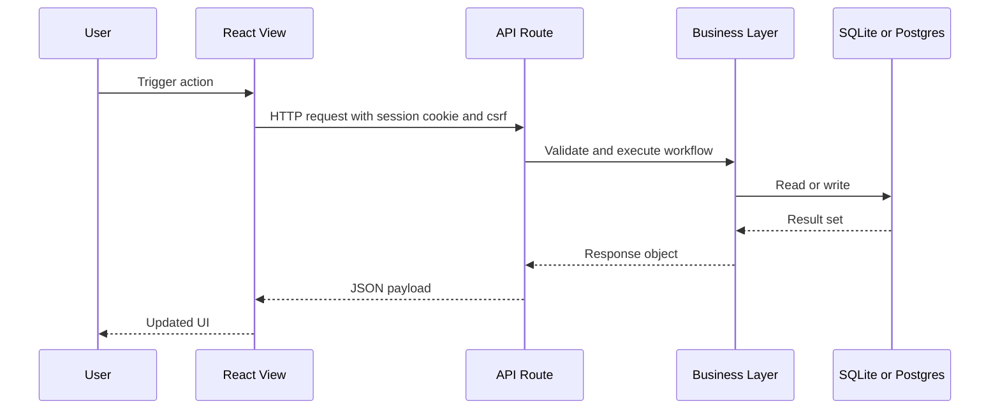
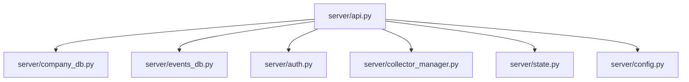
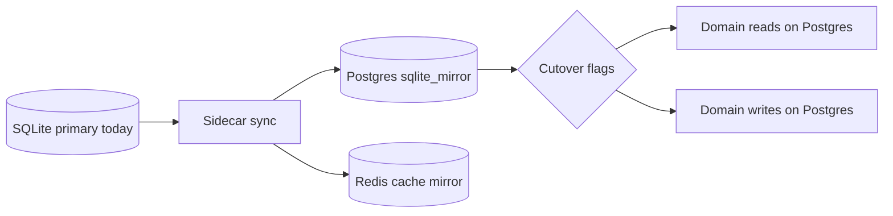
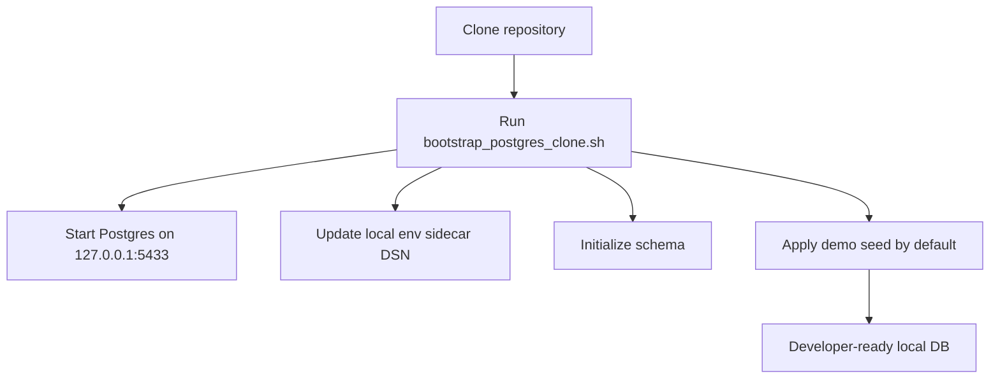
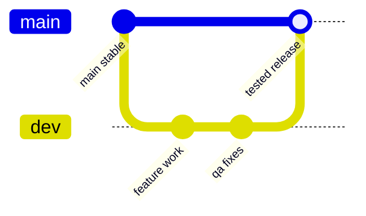

# HJAY9672-WN Portable Project Documentation

This document gives developers a broad, visual understanding of the project and how to work safely in it.

## 1. Project Overview

This repository contains the YNF Deals livestream operations platform, including:

- Legacy backend runtime under whatnot-collector/server
- FastAPI additive runtime under whatnot-collector/app
- Dashboard frontend under whatnot-collector/dashboard-vite
- Operational scripts, migration tooling, and backup assets

Primary runtime URL:

- http://127.0.0.1:8088

## 2. System Map



## 3. Repository Layout

- whatnot-collector/
	- app/: FastAPI app, API routers, services, workers
	- server/: legacy runtime, business logic, collector orchestration
	- dashboard-vite/: React/Vite frontend
	- docs/: architecture, runbooks, migration docs
	- tools/: profiling and maintenance scripts
	- data/: runtime state, backups, migration artifacts
- medusa/: integration scaffolding
- tools/: top-level helper scripts

## 4. Runtime and Request Flow



## 5. Backend Ownership Map



- Route contracts and transport: server/api.py
- Business persistence and schema logic: server/company_db.py
- Raw event interpretation: server/events_db.py
- Auth, sessions, csrf: server/auth.py
- Collector lifecycle and process state: server/collector_manager.py
- JSON runtime state handling: server/state.py
- Environment and path config: server/config.py

## 6. Frontend Route Map

```mermaid
flowchart LR
	APP[src/App.jsx] --> TV[/]
	APP --> OP[/operator]
	APP --> TVS[/operator/tv-scanner]
	APP --> WS[/operator/winner-scanner]
	APP --> OBS[/operator/obs]
	APP --> SES[/session]
	APP --> CO[/company]
```

## 7. Data and Migration View



## 8. PostgreSQL Artifacts in Git

Lightweight SQL artifacts are committed for portability:

- whatnot-collector/data/strong_backups/session_cleanup_keep_18_20260430_180610/postgres_session_tables_data.sql (placeholder)
- whatnot-collector/data/strong_backups/session_cleanup_keep_18_20260430_180610/postgres_session_tables_schema.sql
- whatnot-collector/data/strong_backups/session_cleanup_keep_18_20260430_180610/postgres_session_tables_demo.sql

Large historical archive remains out of git:

- whatnot-collector/data/migration_backups/whatnot_sidecar_sqlite_mirror_before_postgres_enable_20260430_164807.sql (about 15 GB)

## 9. Post-Clone Local Bootstrap

Git clone does not execute scripts automatically. Use this one command from whatnot-collector:

- ./scripts/bootstrap_postgres_clone.sh

Bootstrap flow:



## 10. Quick Start

From repository root:

1. cd whatnot-collector
2. python3 -m venv .venv
3. source .venv/bin/activate
4. pip install -r requirements.txt
5. cd dashboard-vite && npm install

Start services:

- API: uvicorn app.main:app --host 0.0.0.0 --port 8088
- Frontend: cd dashboard-vite && npm run dev

## 11. Developer Branch Workflow



Expected process:

1. Developers push feature work into dev through merge requests.
2. QA and acceptance happen on dev.
3. Approved code is merged from dev to main.

## 12. Profiling and Performance

Profiler script:

- whatnot-collector/tools/profile_dashboard_api.py

Example:

- ./.venv/bin/python tools/profile_dashboard_api.py --base-url http://127.0.0.1:8088 --path /api/company/intelligence --rounds 2

## 13. Operator Page References

- Main route: /operator
- Main view source: whatnot-collector/dashboard-vite/src/views/Operator.jsx
- Primary dependencies:
	- /api/stream_status
	- /api/current_lot/products
	- /api/session_stats
	- /api/v2/sessions/current/stats

## 14. Documentation Links

- GITLAB_FULL_DOCUMENTATION.md
- whatnot-collector/README.md
- whatnot-collector/docs/INDEX.md
- whatnot-collector/docs/visual_project_blueprint.md

## 15. Admin Notes

- Keep production secrets out of git.
- Use masked CI/CD variables for credentials and tokens.
- Do not commit large data exports into git history.

