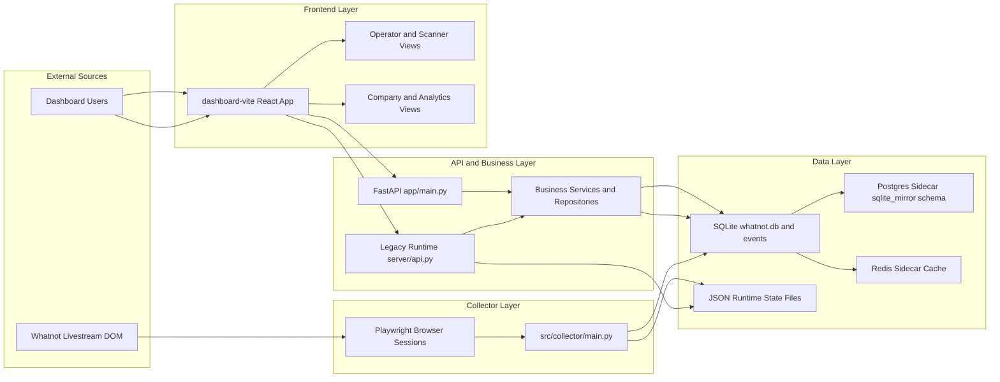
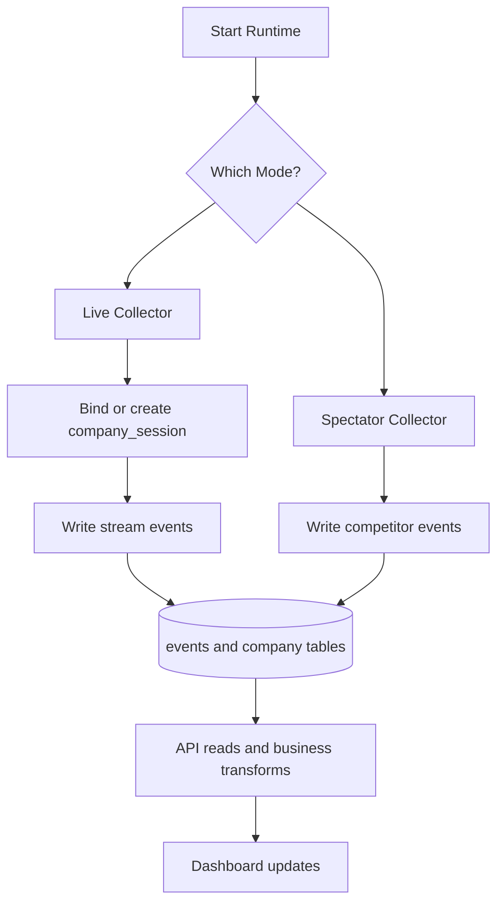
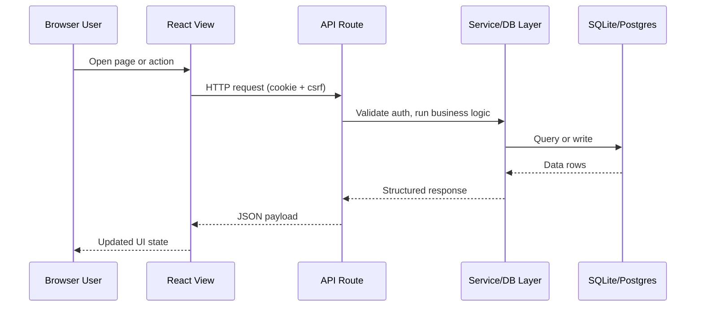
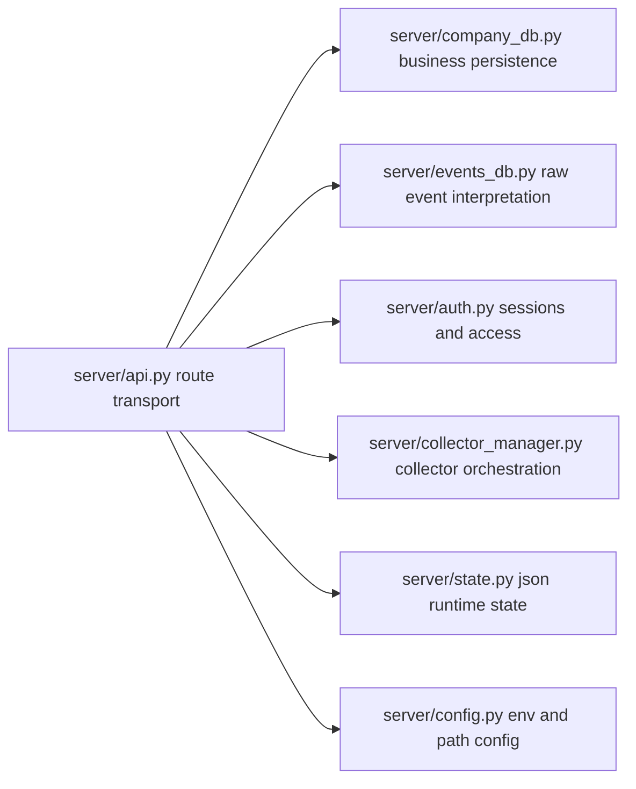
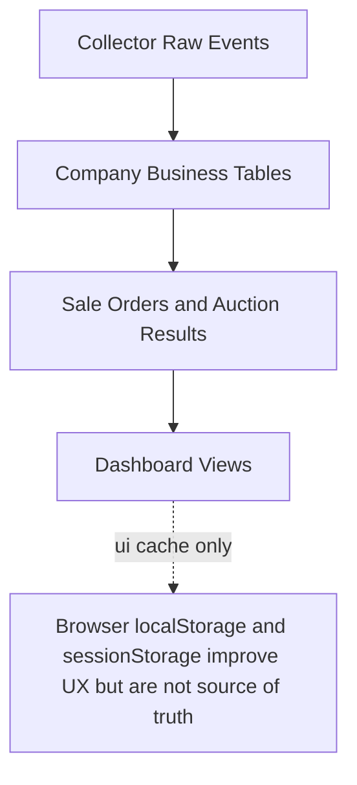
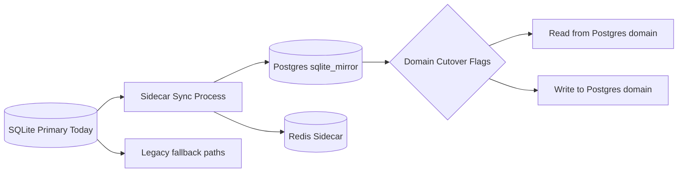
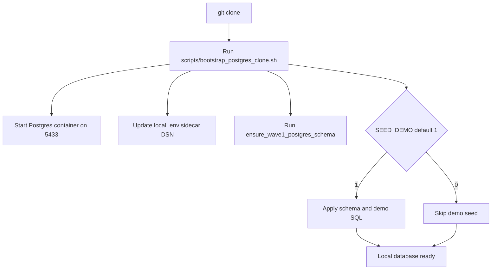
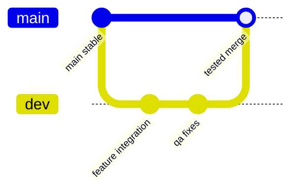
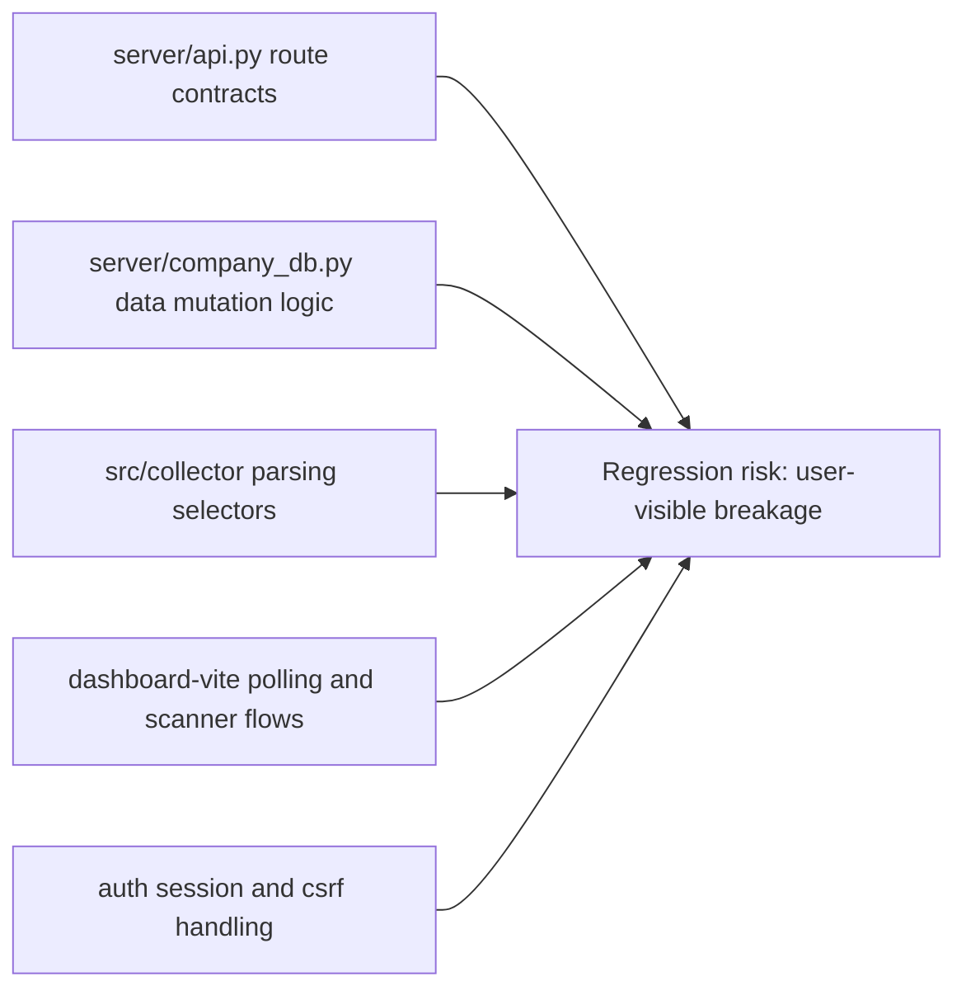

# Visual Project Blueprint

## Purpose
This is the graphical, big-picture guide for the full project.
Use this document when onboarding developers, reviewing architecture, and planning safe changes.

## 1. System At A Glance



## 2. Runtime Modes



## 3. Request Lifecycle



## 4. Backend Responsibility Map



## 5. Frontend Route Map

```mermaid
flowchart TD
  APP[src/App.jsx]

  APP --> TV[/]
  APP --> OP[/operator]
  APP --> TVS[/operator/tv-scanner]
  APP --> WS[/operator/winner-scanner]
  APP --> OBS[/operator/obs]
  APP --> SES[/session]
  APP --> CO[/company]

  CO --> INV[Inventory tabs]
  CO --> ORD[Orders and sessions]
  CO --> ANA[Analytics panels]
```

## 6. Data Truth Hierarchy



## 7. PostgreSQL Migration Topology



## 8. Local Bootstrap Flow (After Clone)



## 9. Developer Git Flow



Policy:
- Developers push feature work to dev via merge requests.
- QA and acceptance happen on dev.
- Only tested changes are merged from dev into main.

## 10. High-Risk Change Zones



## 11. First-Day Read Path For Developers

1. README overview and run commands.
2. This visual blueprint for system map.
3. technical_architecture.md for component depth.
4. backend_architecture.md and frontend_architecture.md for ownership boundaries.
5. testing_guide.md before making any feature changes.

## 12. Quick Command Sheet

From whatnot-collector:

- Start API:
  - `uvicorn app.main:app --host 0.0.0.0 --port 8088`
- Start frontend:
  - `cd dashboard-vite && npm run dev`
- Postgres bootstrap:
  - `./scripts/bootstrap_postgres_clone.sh`
- API profiling:
  - `./.venv/bin/python tools/profile_dashboard_api.py --base-url http://127.0.0.1:8088 --path /api/company/intelligence --rounds 3`

## 13. Related Documents

- technical_architecture.md
- backend_architecture.md
- frontend_architecture.md
- api_reference.md
- database_schema_reference.md
- sidecar_mirror_guide.md
- postgres_primary_cutover_plan.md
